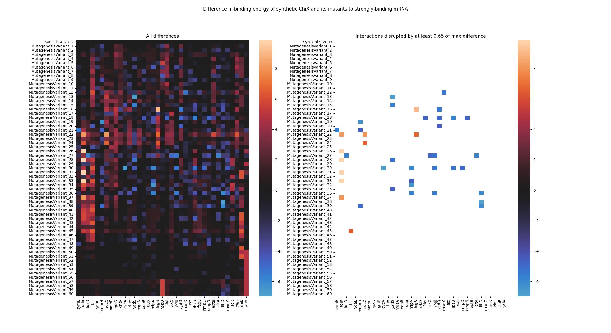

# Designing sRNA circuits

Genetic circuits can be designed to enact functions in cells to do useful things. One continuous area of research is on RNA circuits, which typically use RNA molecules like small RNA (sRNA) or sponge RNA to enact changes directly to the messenger RNA (mRNA). Compared to other mechanisms, this is a fast and dynamic way to enact logic in biological circuits.

However, there are many challenges that arise when designing RNA circuits. For example the host cell machinery can interfere with synthetic RNAs and resource competition can lead to unexpected behaviours. In our lab, we are in the process of investigating an RNA circuit (involving both sRNA and sponge RNA logic) that behaves differently based on the growth stage of the cell.

Here, we explore the RNA interactome of E. coli to try to identify potential host sRNA or mRNA moelcules that could be interfering with our synthetic RNA circuit. We also examine the RNA binding protein and chaperone Hfq and its potential interference with the RNAs in our circuit, leveraging ML models to predict RNA-protein interactions.

